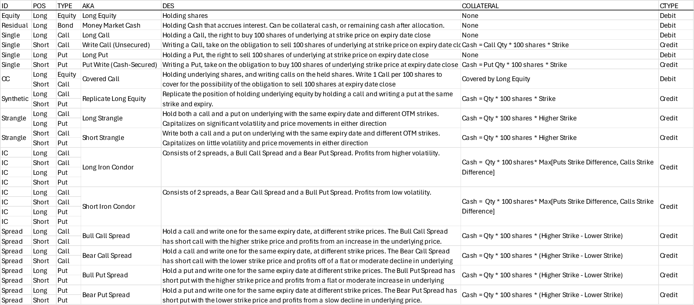

# Options Backtester
Interface for backtesting dynamic option portfolios.

## User Interface : Inputs
1. Start Date & End Date: Time range for backtest
2. Portfolio file: csv file path for option legs.
3. Underlying Asset Ticker + Country Code

## Option Set Configuration
Building Blocks:

Set of option legs defined in a csv file.

Instead of using user-defined quantities, the backtester:
* first parses through all option legs and matches same expiry date options to determine dependencies (put/call spreads)
* defines needed shares and cash reserve for each option
* then allocates default cash amount of 1000000 (unless defined otherwise) based on constraints 

## Allocation

## Backtest

## Outputs
